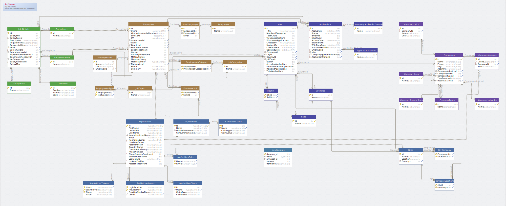

# Wuzzufny


Wuzzufny is a job board web app mainly focus on IT field vacancies, with the simplest user interface to provide a suitable experiment for all users

## Tools used
- .Net 5
- Asp Web API core
- Entity Framework core
- Microsoft sql server
- Angular 11
- Bootstrap
- Prime Ng

## Installation

Use the package manager [npm](https://www.npmjs.com/) to install the required packages and angular cli.
then run the angular server
```bash
npm install
ng serve
```
open the solution with visual studio, run the backend and visit the app using your preferred browser

## Database


## meet our team
| Name                     | GitHub                                               | 
| :----------------------- | :--------------------------------------------------- |
| **Ahmed Abdallah**       | [**@Abdallah**](https://github.com/AhmadAbdallah0-0) |
| **Ahmed Mahmood Qenawy** | [**@Qenawy**](https://github.com/A-Qenawy)           |
| **Ahmed Samir**          | [**@Samir**](https://github.com/AhmmedSamier)       |
| **Ashraf Mohamed**       | [**@Ashraf**](https://github.com/ashrafnosser)       |
| **Eman Mohamed**         | [**@Eman**](https://github.com/emanmohamed1234)    |
| **Mohamed Erfan**        | [**@Erfan**](https://github.com/MohamedErfan1998)   |
| **Saed Hossam**          | [**@Saed**](https://github.com/SaedHossam)         |

